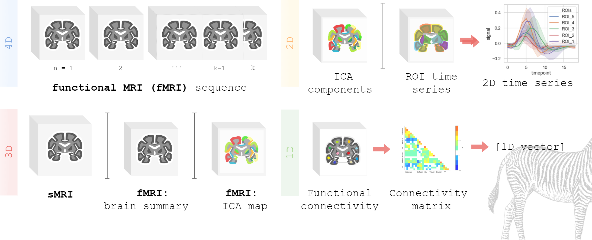

# fmri-domain-adaptation-zoo

**Domain Adaptation** methods adapted for functional MRI (fMRI) data analysis. 

Enjoy building domain-agnostic models on all levels of data abstraction with our **models zoo** 🦓.

Author: Marina Pominova `@PominovaMS`
Review, data processing and baseline: Ekaterina Kondrateva `@kondratevakate`

<p align="center">
  
</p>


Dataset: Autism Brain Imaging Data Exchange (ABIDE)
```Adriana Di Martino, Chao-Gan Yan, Qingyang Li, Erin Denio, Francisco X Castellanos,
Kaat Alaerts, Jeffrey S Anderson, Michal Assaf, Susan Y Bookheimer, Mirella Dapretto,
et al. The autism brain imaging data exchange: towards a large-scale evaluation of the
intrinsic brain architecture in autism. Molecular psychiatry, 19(6):659–667, 2014.
```


Our lab cite, please refer: http://adase.group/neuro/
